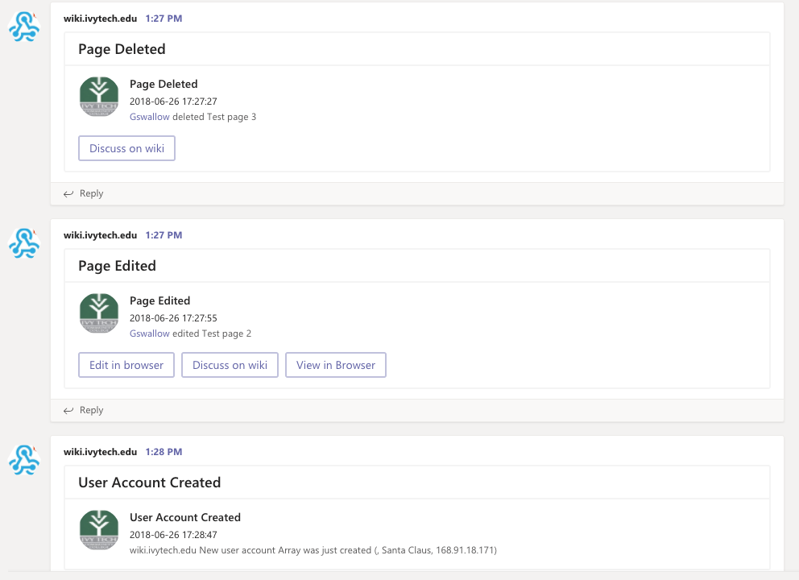

# MSTeams MediaWiki Notifications

This is a extension for [MediaWiki](https://www.mediawiki.org/wiki/MediaWiki)
that sends notifications of actions in your Wiki like editing, adding or
removing a page into a Microsoft Teams Channel.  I borrowed the majority of
this from the [Slack](https://github.com/kulttuuri/slack_mediawiki) extension.
Thanks, @kulttuuri!

There are also extensions that can send notifications to 
[HipChat](https://github.com/kulttuuri/hipchat_mediawiki) 
or [Discord](https://github.com/kulttuuri/discord_mediawiki).

Microsoft Teams uses "actionable message cards" for 


## Supported MediaWiki operations to send notifications

* Article is added, removed, moved or edited.
* New user is added.
* ... and each notification can be individually enabled or disabled :)

## Requirements

* [cURL](http://curl.haxx.se/). This extension also supports using
`file_get_contents` for sending the data. See the configuration parameter
`$wgTeamsSendMethod` below to change this.
* PHP-cURL extensions
* PHP-JSON extensions
* MediaWiki 1.8+ (tested with version 1.8, also tested and works with 1.25+)
* Apache should have NE (NoEscape) flag on to prevent issues in URLs. By default
you should have this enabled.

## How to install

1) Create a new Teams Incoming Webhook. When setting up the webhook, define
channel where you want the notifications to go into.

2) After setting up the Webhook you will get a Webhook URL. Copy that URL as
you will need it in step 4.

3) CLone this repository and move files into your
`mediawiki_installation/extensions/MSTeamsNotifications` folder.

4) Add settings listed below in your `mediawiki_installation/LocalSettings.php`.
Note that it is mandatory to set these settings for this extension to work:

```php
require_once("$IP/extensions/MSTeamsNotifications/MSTeamsNotifications.php");

// Required. Your Teams incoming webhook URL.
$wgTeamsIncomingWebhookUrl = "";

// Time zone to use in messages.
$wgTeamsTimeZone = "US/Eastern";

// Required. Name the message will appear to be sent from. Change this to 
// whatever you wish it to be.
$wgTeamsFromName = $wgSitename;

// URL into your MediaWiki installation with the trailing /.
$wgWikiUrl		= "http://your_wiki_url/";

// URL of your MediaWiki personalized logo
$wgWikiLogoUrl    = "https://www.mediawiki.org/static/images/project-logos/mediawikiwiki.png";

// Wiki script name. Leave this to default one if you do not have URL rewriting
// enabled.
$wgWikiUrlEnding = "index.php?title=";

// What method will be used to send the data to Teams server. By default this
// is "curl" which only works if you have the curl extension enabled. This can
// be: "curl" or "file_get_contents". Default: "curl".
$wgTeamsSendMethod = "curl";
```

5) Enjoy the notifications in your Teams room!
	
## Additional options

These options can be set after including your plugin in your localSettings.php file.

### Ignore Minor Edits

You can choose to ignore edits that a page editor has marked as minor.

```php
// If this is true, all minor edits made to articles will not be submitted to Teams.
$wgTeamsIgnoreMinorEdits = false;
```

### Disable new user extra information

By default we show full name, email and IP address of newly created user in the
notification. You can individually disable each of these using the settings
below. This is helpful for example in situation where you do not want to expose
this information for users in your Teams channel.

```php
// If this is true, newly created user email address is added to notification.
$wgTeamsShowNewUserEmail = true;

// If this is true, newly created user full name is added to notification.
$wgTeamsShowNewUserFullName = true;

// If this is true, newly created user IP address is added to notification.
$wgTeamsShowNewUserIP = true;
```

### Disable notifications from certain user roles

By default notifications from all users will be sent to your Teams room. If you
wish to exclude users in certain group to not send notification of any actions,
you can set the group with the setting below.

```php
// If this is set, actions by users with this permission won't cause alerts
$wgExcludedPermission = "";
```

### Disable notifications from certain pages / namespaces

You can exclude notifications from certain namespaces / articles by adding them
into this array. Note: This targets all pages starting with the name.

```php
// Actions (add, edit, modify) won't be notified to Teams room from articles starting with these names
$wgTeamsExcludeNotificationsFrom = ["User:", "Weirdgroup"];
```

### Actions to notify of

MediaWiki actions that will be sent notifications of into Teams. Set desired
options to false to disable notifications of those actions.

```php
// New user added into MediaWiki
$wgTeamsNotificationNewUser = true;

// Article added to MediaWiki
$wgTeamsNotificationAddedArticle = true;

// Article removed from MediaWiki
$wgTeamsNotificationRemovedArticle = true;

// Article moved under new title in MediaWiki
$wgTeamsNotificationMovedArticle = true;

// Article edited in MediaWiki
$wgTeamsNotificationEditedArticle = true;
```
	
## Additional MediaWiki URL Settings

Should any of these default MediaWiki system page URLs differ in your
installation, change them here.

```php
$wgWikiUrlEndingUserRights          = "Special%3AUserRights&user=";
$wgWikiUrlEndingUserPage            = "User:";
$wgWikiUrlEndingUserTalkPage        = "User_talk:";
$wgWikiUrlEndingUserContributions   = "Special:Contributions/";
$wgWikiUrlEndingEditArticle         = "action=edit";
$wgWikiUrlEndingHistory             = "action=history";
$wgWikiUrlEndingDiff                = "diff=prev&oldid=";
```

## Setting proxy

To add proxy for requests, you can use the normal MediaWiki way of 
setting proxy, as described [here](https://www.mediawiki.org/wiki/Manual:$wgHTTPProxy). 
Basically this means that you just need to set `$wgHTTPProxy`
parameter in your `localSettings.php` file to point to your proxy.

## Contributors

* [@jacksga](https://github.com/jacksga)
* [@Meneth](https://github.com/Meneth)

## License

[MIT License](http://en.wikipedia.org/wiki/MIT_License)
